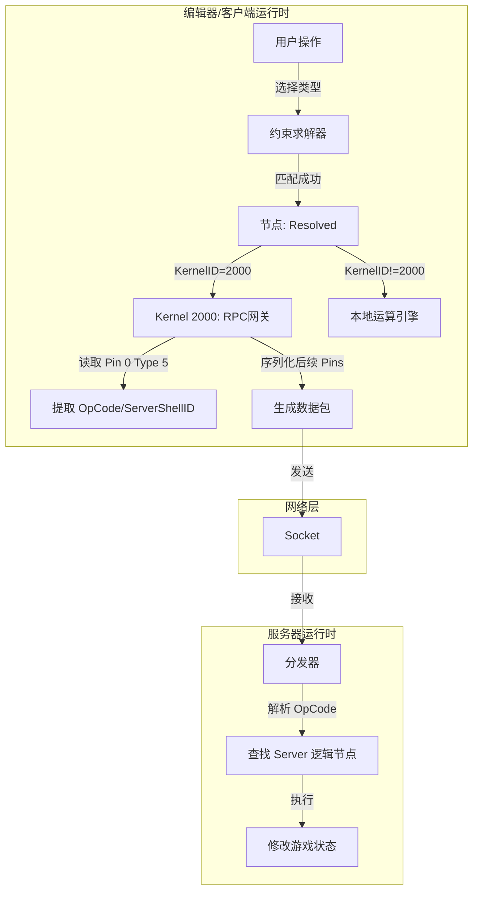

# 节点图系统内部机理逆向工程文档 (Internal Architecture Documentation)

## 1. 系统概览 (System Overview)

本系统采用经典的 **C/S (Client-Server) 分离架构**。虽然用户在一个统一的编辑器中操作，但节点图实际上分为两个在不同环境运行的子系统，二者通过特定的通信协议桥接。

* **子系统 A (Server-side)**: **权威逻辑层**。
* 运行环境：服务器。
* 核心职责：执行真正的游戏逻辑、状态管理、数据库读写。
* 特点：拥有独立的 ID 空间，逻辑节点与实现一一对应（大部分情况）。

* **子系统 B (Client-side)**: **表现与代理层**。
* 运行环境：客户端/编辑器。
* 核心职责：
1. **本地运算 (Pure Calc)**：简单的数学运算、逻辑判断（不涉及服务器状态）。
2. **RPC 代理 (Skill/Action)**：负责收集参数并发送指令给服务器，自身不执行业务逻辑。
3. **UI 交互**：显示节点外壳。

## 2. 核心对象模型：外壳与内核 (The Shell-Kernel Model)

这是本系统最核心的设计模式，用于解决“显示”与“执行”的分离，以及“多态”的实现。

### 2.1 节点构造

每个节点由三部分组成：

1. **Shell (外壳 / Definition)**:
* **定义**：用户在 UI 上看到的节点形态。
* **职责**：定义引脚布局（UI 顺序）、节点名称、分类。
* **ID**：`ShellID` (全局唯一)。

2. **Kernel (内核 / Implementation)**:
* **定义**：底层实际执行的函数或指令集。
* **职责**：接收参数列表，执行操作。
* **ID**：`KernelID` (在 Server/Client 内部唯一)。

3. **Binding (绑定 / Mapping)**:
* **定义**：连接 Shell 与 Kernel 的桥梁。
* **机制**：`Shell Pin (i1)`  `Kernel Pin (i2)`。
* **重排**：外壳的引脚顺序（为了美观）可能与内核需要的参数顺序（为了内存布局）不一致，绑定层负责重映射。

* **现象解释**：这就是为什么客户端的“加法”和“减法”外壳不同，但内核 ID 却相同。区别仅在于 Pin 0 的隐藏值不同（一个指向 MathOperator.ADD，一个指向 MathOperator.SUBTRACT）。

### 2.2 节点的生命周期状态

* **未决议态 (Unresolved / Dirty)**:
* 对于可变节点（泛型），当用户刚拖入画布，未选择类型时，`KernelID` 为空 (`Null`)。此时节点不可执行，不可连接数据线。

* **决议态 (Resolved / Ready)**:
* 用户选择类型（如 `Int`）后，通过 **约束求解器 (Constraint Solver)** 查表，找到了对应的 `KernelID`（例如 `Math_Add_Int`）。此时节点变为有效。

## 3. 核心机制解密 (Core Mechanisms)

### 3.1 客户端 RPC 机制 (Kernel 2000)

在子系统 B（客户端）中，几乎所有的“执行类”节点（Action/Skill）底层都指向同一个内核：**Kernel 2000**。

* **本质**：`Kernel 2000` 是一个 **通用序列化网关 (Generic Serializer / RPC Stub)**。
* **工作流**：
1. **识别身份**：读取 **Type 5 引脚 (Pin 0)** 的元数据。该引脚存储了对应的**服务端 Shell ID**（即 RPC OpCode）。
2. **打包参数**：遍历后续所有数据引脚，无视类型（弱类型处理），将其序列化为二进制流或 JSON 包。
3. **发送**：将包头（OpCode）和包体（Args）发送给服务器。

### 3.2 信号与动态路由 (Signal & Dynamic Routing)

`SendSignal` 类节点展示了系统的高级动态特性。

* **结构**：
* **Pin 0 (Type 5)**: **协议头**。固定值 0（通过 meta 信息告诉网关它的来源节点类型）。
* **Pin 1 (Type 5)**: **路由键 (Topic)**。用户输入的信号名称（如 "PlayerDead"）。
* **Pin 0+(Type 4)**: 信号载荷 (Payload), 通过内部线路重新绑定到内核的 Type 5 2+。

* **全局声明与索引查找 (Global Declaration & Index Lookup)**:
* **预声明机制**：信号必须在使用前于全局信号注册表中进行声明，而非即时（JIT）生成。
* **动态 ID 分配**：在声明阶段，系统会按顺序为每个信号分配一个唯一的动态 ID。
* **查找映射**：当用户在节点中输入信号名时，系统执行的是查找过程，将名称字符串映射回预先分配的动态 ID。

* **错位现象**：客户端的 Pin 0（Opcode）在服务端会被剥离，服务端的 Send Signal Pin 0 直接对应客户端的 Pin 1（Topic）。

### 3.3 多态与常量注入 (Polymorphism & Constant Injection)

可变节点（如 `Add<T>`）如何适配不同的底层实现？

* **变体表 (Variant Table)**: 每个可变节点内部维护一张表：
* `Map<{ Selector: Int }, KernelID>`
* 例：`Selector=0 (Int)`  `Kernel=501`
* 例：`Selector=1 (Float)`  `Kernel=502`

* **隐式常量注入 (Implicit Constant Injection)**:
* 某些节点有隐藏引脚。
* 当 `Variant` 切换时，不仅切换 Kernel ID，还会修改这些隐藏引脚的**固定默认值**。
* **案例**：浮点数比较节点可能注入一个 `Epsilon = 0.0001` 的隐藏参数，而整数比较节点注入 `Epsilon = 0` (并不是, 浮点数和整数的运算不再一个内核)。

## 4. 数据结构实体 (Internal Data Structures)

### 4.1 引脚类型 (Pin Types)

系统是强类型的，分为以下层级：

1. **流 (Flow)**: 无类型，仅控制执行顺序。
2. **数据 (Data)**:
* **原子类型 (10+2+1种)**: `Int`, `Flt`, `Bol`, `Str`, `Vec`, `Gid`, `Ety`, `Pfb`, `Fct`, `Cfg` + `Loc`, `Vss` + `Enum`。
* **复合类型**: `L<T>` (List), `D<K,V>` (Map)。
* **引用类型**: 实际上大部分非原子类型在内部均以**指针**形式传递。

其中, 枚举类型仅对外壳连线选择器生效, 用于限制可相互连接的节点引脚(和UI下拉选单显示), 但内部枚举值对全体枚举是通用的.

### 4.2 类型选择器 (Type Selector)

* 可变节点通过一个或多个下拉菜单（Selector）决定类型。
* **约束逻辑**：并不是任意组合都有效。存在一个全局的 **`S<K, V>` 结构体列表**。
* 只有当用户选择的组合匹配列表中的某一项时，节点才合法。
* 这实际上是一种**反射 (Reflection)** 机制的静态预设。

## 5. 总结：数据流向全景图

### 关键结论

1. **Type 5 是钥匙**：它是连接客户端表现与服务端逻辑的唯一纽带（OpCode Carrier）。
2. **Kernel 2000 是桥梁**：它抹平了强类型的差异，负责数据的搬运。
3. **Shell/Kernel 分离是基础**：它使得编辑器可以灵活展示（Shell），而运行时保持高效（Kernel），并优雅地处理了 RPC 代理的问题。
